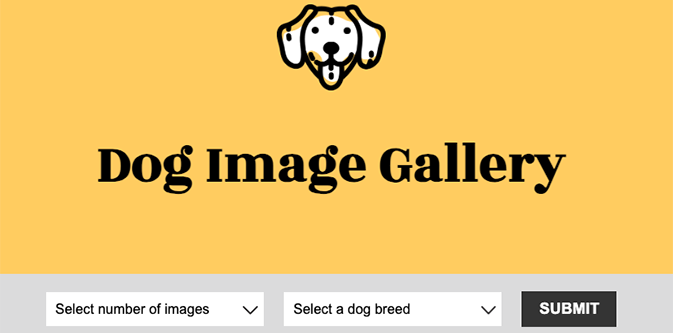

# Dog Photo Gallery
An interactive web application that uses Python, Flask, and a REST API to display dog photos.  

## About
In the Dog Photo Gallery app, users can:

- see dog photos based on their selection of number of photos and dog breed from a drop down menu.
- see a random dog photo on the click of a button.

## Project Background
The Dog Photo Gallery app was built as part of Skillcrush's "Using Python to Build Web Apps" course. 

The app is created with the Flask web framework. It uses routing and HTTP methods to retrieve user input, request dog photos from the Dog API (a REST API), and render data to the frontend. Jinja places the data in the app's HTML template.   

During this project, I practiced: 

- routing API data to the web app, incl. setting up routes using GET and POST methods and using the request object from the Flask request module to access incoming data from the drop-down menu. 

- requesting data from a REST API with the requests.get() method.

- converting JSON file data to a Python dictionary to access JSON data and allow for rendering of the data on the app's frontend. 

- handling user errors when they push the submit button without making a selection from the drop-down menu. 

- using Jinja placeholders to place photos in the HTML template.

- adding a drop-down menu to the HTML template and logic to the main.py file for selecting the number of dog photos to be shown.

- adding a form to the HTML template for a button that will show a new random dog photo as well as routing in the main.py file to retrieve a random dog photo from the API and return/render it to the frontend. 
 
## Built With 
- Python
- Flask
- Python's requests library
- Jinja 
- CSS3
- HTML5

## Launch
[See the live version of the Dog Photo Gallery app here.](https://replit.com/@lonemortensen/skillcrush-py-cl02-ls11-dog-photos-random-jinja-flask-final)

## Acknowledgements

**Skillcrush** - I built on the Dog Photo Gallery app's Python file (main.py) and used Jinja to place data in the app's HTML file with support and guidance from Skillcrush. The app's HTML and CSS files and their contents were provided by Skillcrush.  